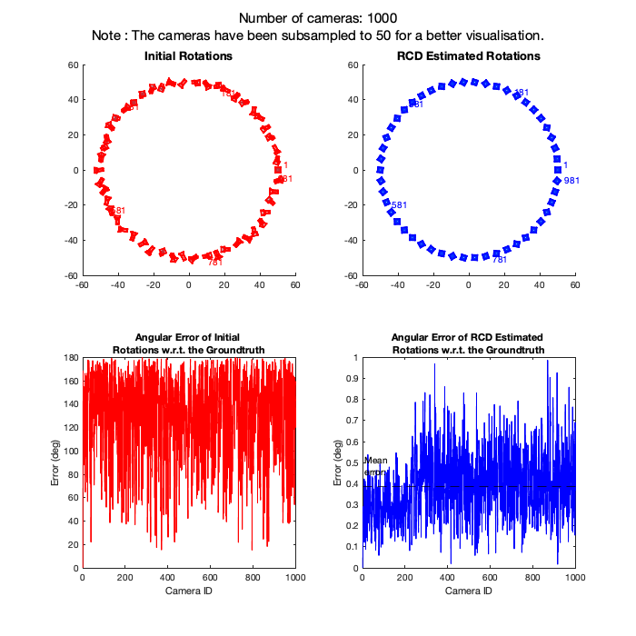
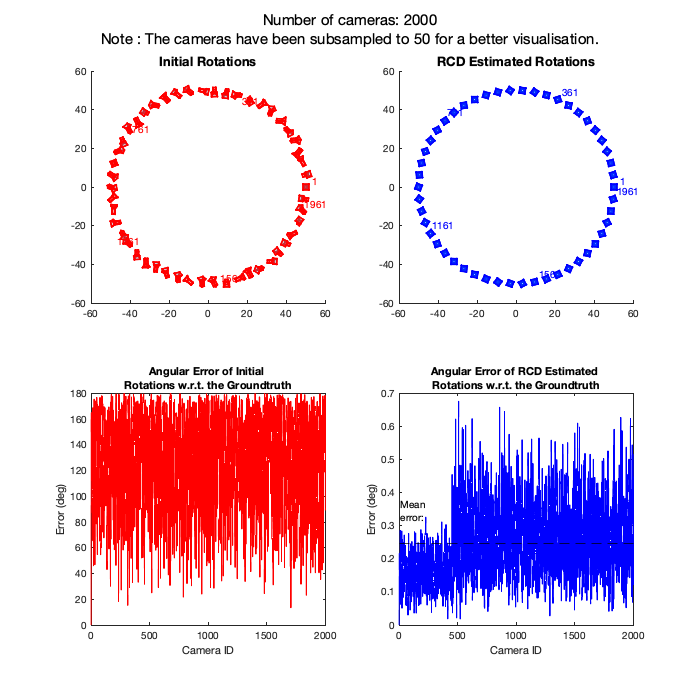
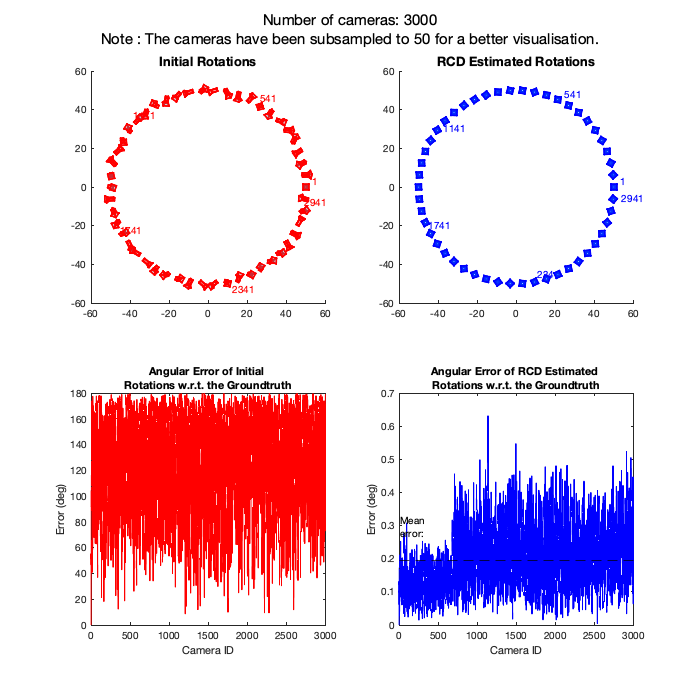
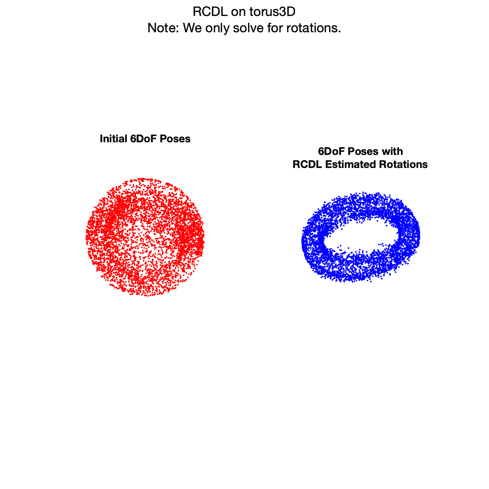
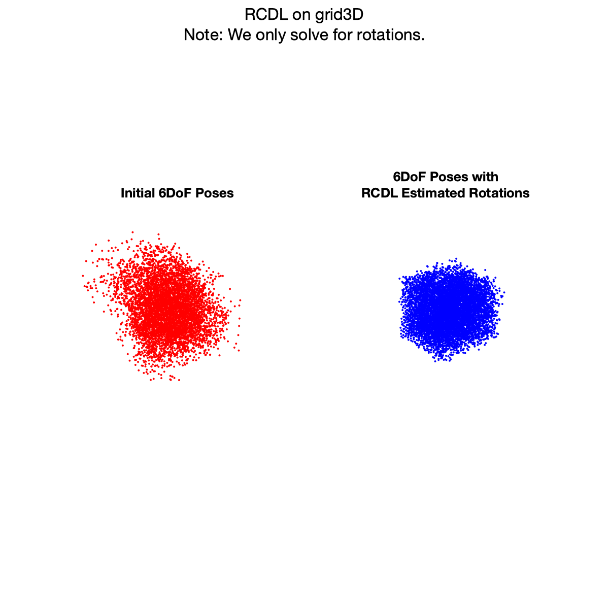

-------------
**RCD: Rotation Coordinate Descent**
-------------

Rotation Coordinate Descent (RCD) is a fast rotation averaging algorithm that achieves global optimality under mild noise conditions on the noise level of the measurements.

## Citation ##

``` 
@inproceedings{parra2021rotation,
  title={Rotation Coordinate Descent for Fast Globally Optimal Rotation Averaging},
  author={Parra, Alvaro and Chng, Shin-Fang and Chin, Tat-Jun and Eriksson, Anders and Reid, Ian},
  booktitle={Proceedings of the IEEE/CVF Conference on Computer Vision and Pattern Recognition},
  pages={4298--4307},
  year={2021}
}
```

## Quick Start
This demo runs in MATLAB, with **RCD** and **RCDL** compiled in C++.
We tested under version R2020a on systems with:
- macOS Catalina
- Ubuntu 18.04


## Setup ##
Dependencies:
   1. CMake 3.0 or later **required** [cmake installation link](https://cmake.org/install/)
      - *MacOS*   
      ```brew install cmake```

      - *Ubuntu*  
      ```sudo apt-get install cmake```

   2. SuiteSparse **required**
      - *MacOS*
        ```brew install suite-sparse```

      - *Ubuntu*
        ```sudo apt-get install libsuitesparse-dev```


## Running demo ##

### Building RCD and RCDL libraries
 We provide a script build.sh to build **RCD** and **RCDL**.
   Please make sure you have installed all required dependencies (see Section 1).
   Execute
   ``` 
   chmod +x build.sh
    ./build.sh
   ```
   which will create the executables **RCD** and **RCDL** in *bin* folder.
   
### Running RCD
  Run **demo_rcd.m** in MATLAB.
  
  Here, we provide a demonstration on 3 different SfM camera graphs where *number of nodes* = 1000, 2000 and 3000 and *graph density* = 0.4.
  This demo is expected to finish in about 1 minute, which will generate the following outputs:
  
    
  
### Running RCDL
  Run **demo_rcdl.m** in MATLAB.
  
  Here, we provide a demonstration on 2 different SLAM camera graphs which are torus3D and grid3D.
  This demo is expected to finish in about 1 minute, which will generate the following outputs:
  
                   
   
   

  
  
